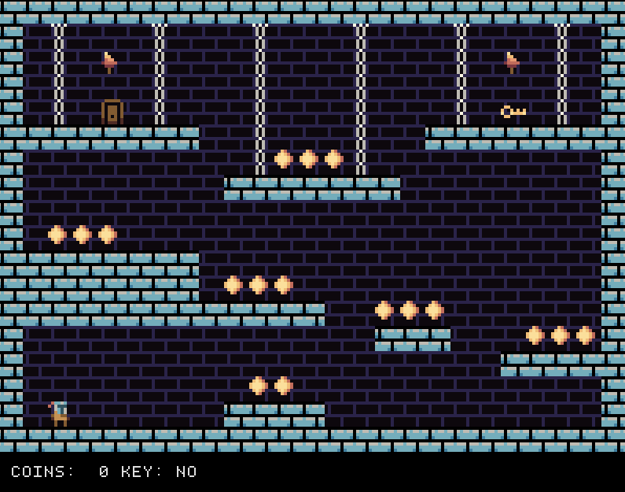

# knighty
Knighty is a simple tile based platform game written in C99 using SDL2. The tilemaps and animated tileset are created using Tiled.

## Motivation
The basic idea behind this project was to write the least amount of code that does the absolute minimal thing to get a simple game up and running, not bothering with writing an engine first or design an abstraction of an abstraction of what any platformer game would look like (OOP).

## Compiling
In order to compile the game needs SDL2, [stb_image](https://github.com/nothings/stb) and [json.h](https://github.com/sheredom/json.h). The paths for these libraries are defined in [premake5.lua](premake5.lua).

## Controls
- [Left arrow] - Move left
- [Right arrow] - Move right
- [X] - Jump
- [Z] - Open Chest
- [Escape] - Close the game
- [F5] - Reload the current level

## Credits
- Font: [https://opengameart.org/content/ascii-bitmap-font-oldschool](https://opengameart.org/content/ascii-bitmap-font-oldschool)
- STB: [https://github.com/nothings/stb](https://github.com/nothings/stb)
- json.h: [https://github.com/sheredom/json.h](https://github.com/sheredom/json.h)

## Miscellaneous
The art was drawn by myself and is actually my ever first attempt to draw pixel art. I decided to use 8x8 pixels because of my garbage drawing skills 16x16 or even 32x32 would result in much more detailed tiles.